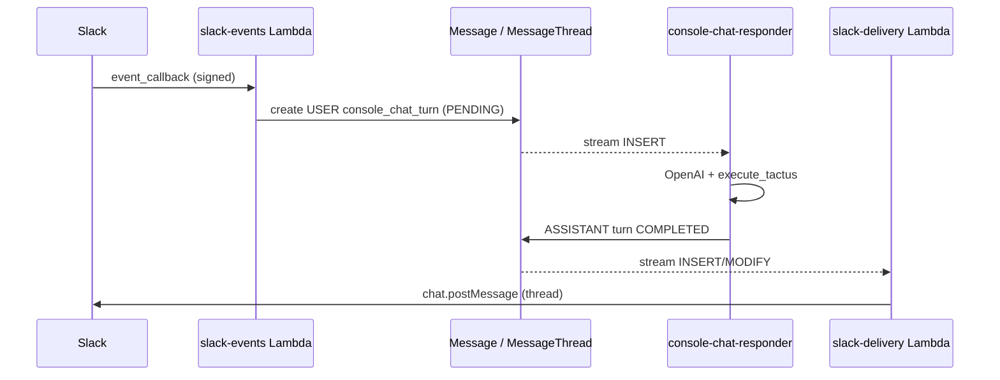

# Papyrus Slack Agent Channel

The Slack app is a third agent channel alongside the web console and inbound email.
All three enqueue `console_chat_turn` messages on the `consoleChat` feed; the
**console-chat-responder** Lambda runs the same agent loop and **`execute_tactus`**
tool surface as the editor console.

## Architecture

## Enable in Amplify

Set sandbox or pipeline env vars:

- `PAPYRUS_ENABLE_SLACK=true`
- `PAPYRUS_SLACK_SIGNING_SECRET` (Amplify secret)
- `PAPYRUS_SLACK_BOT_TOKEN` (Amplify secret, `xoxb-…`)
- Optional: `PAPYRUS_SLACK_ALLOWED_USER_IDS` (comma-separated Slack user IDs)
- `PAPYRUS_CONSOLE_RESPONSE_TARGET=cloud` (same as email/console)

Deploy; `amplify/backend.ts` adds a custom output `slackEventsUrl` (Lambda function URL).
Point the Slack app **Event Subscriptions** request URL at that URL.

### Production (`main` branch)

1. Merge or deploy `main` via Amplify Gen 2 (push to `main` triggers the pipeline).
2. In the Amplify console for the **main** backend, set branch env vars and secrets above.
   Slack Lambdas are created only when `PAPYRUS_ENABLE_SLACK=true`.
3. After a successful deploy, open **Backend deployments → Outputs** (or `amplify_outputs`)
   and copy `slackEventsUrl` into the Slack app Event Subscriptions request URL.
4. Reinstall the Slack app to the workspace if you changed bot scopes.

### Slack app scopes (minimum)

- `app_mentions:read`
- `chat:write`
- `im:history`, `channels:history` (for DMs / public channels you use)

Subscribe to bot events: `message.im`, `message.channels`, `app_mention`.

## Shared code

| Module | Role |
|--------|------|
| `src/papyrus_newsroom/console_chat_enqueue.py` | Shared GraphQL enqueue for multi-channel agents |
| `src/papyrus_newsroom/slack_agent.py` | Slack verify, prompt, enqueue, delivery |
| `amplify/functions/shared/console-chat-enqueue.ts` | TypeScript enqueue (slack-events handler) |
| `amplify/functions/slack-events/` | Signed Events API ingress |
| `amplify/functions/slack-delivery/` | Post assistant replies to Slack threads |

Email continues to use `email_submission_replies.enqueue_console_chat_*`; new channels
should call `console_chat_enqueue.enqueue_console_chat_turn` (Python) or
`console-chat-enqueue.ts` (Lambda TypeScript).

## Operations

- Idempotency: Slack `event_id` maps to deterministic `message-console-slack-*` ids.
- Authorization: when `PAPYRUS_SLACK_ALLOWED_USER_IDS` is empty, all non-bot users are accepted (dev only).
- Truncation: outbound Slack text is capped at 12k characters.
